# Using OnlineGDB

OnlineGDB is an online debugger. It lets you step through your code line by line and check the values of variables and constants in the current scope.

We will be using the previously discussed [`TemperatureConversion`](#temperatureConversion) class and its [client](#exClientClass) to demonstrate the debugger. For convenience, they are provided below:

<a name="temperatureConversion"></a>

```java
class TemperatureConversion
{
    final static double CELC_FAHREN_RATIO = 9.0/5;
    final static int FAHREN_FREEZE_POINT = 32;

    // takes as an argument (input) the temperature in celcius (as a double)
    // returns (outputs) the temperature in fahrenheit (as a double)
    static double celcToFahren(double tempInCelc)
    {
        return tempInCelc * CELC_FAHREN_RATIO + FAHREN_FREEZE_POINT;
    }

    // argument : temperature in fahrenheit, as a double
    // return : temperature in celcius, as a double
    static double fahrenToCelc(double tempInFahren)
    {
        // TODO
        return 0; // replace this return with a correct conversion
    }
}
```

<a name="exClientClass"></a>

```java
class TemperatureConversionClient
{
    public static void main(String[] args)
    {
        double tempInCelcius = 100;

        double tempInFahrenheit = TemperatureConversion.celcToFahren( tempInCelcius );

        System.out.println("Celcius : " + tempInCelcius);
        System.out.println("is equivalent to");
        System.out.println("Fahrenheit : " + tempInFahrenheit);
    }
}
```

## Introduction and Settings

First, go to [https://www.onlinegdb.com](https://www.onlinegdb.com). You should end up at a page that looks like this:
 
 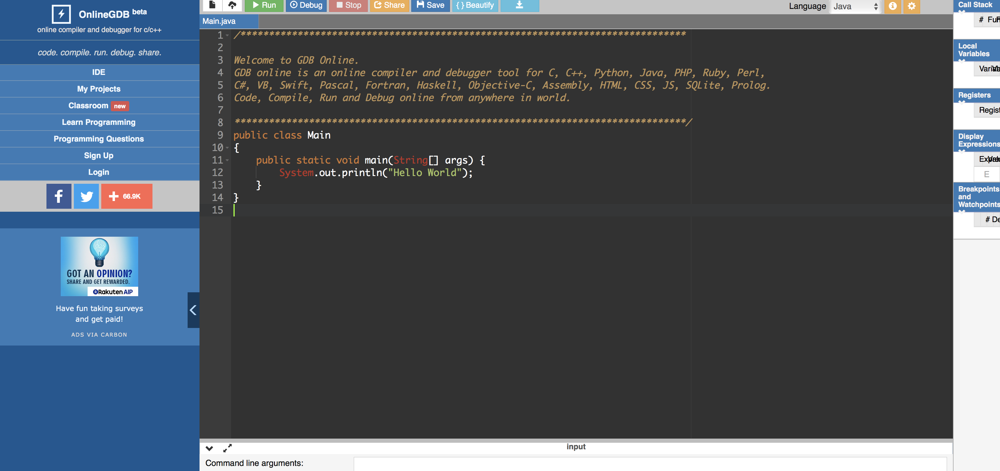
 
First, I'm going to close the menu on the left:

 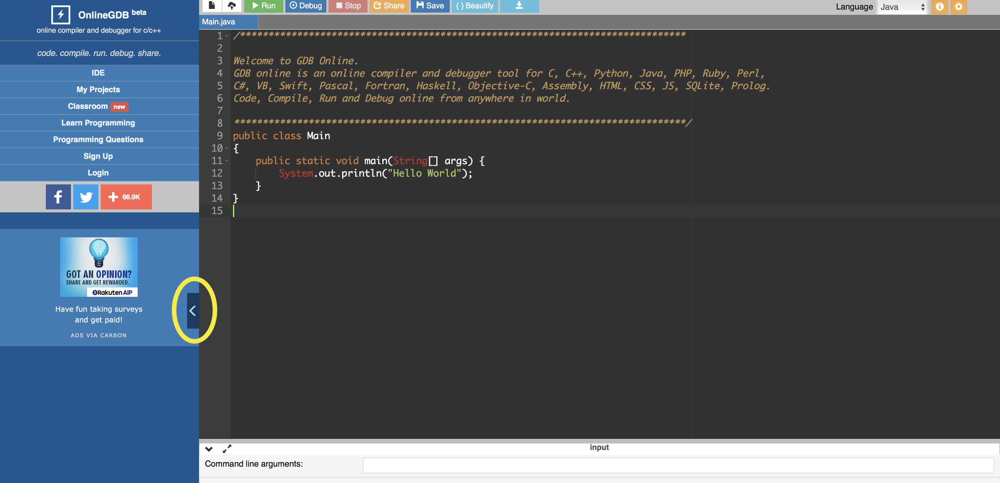
 
 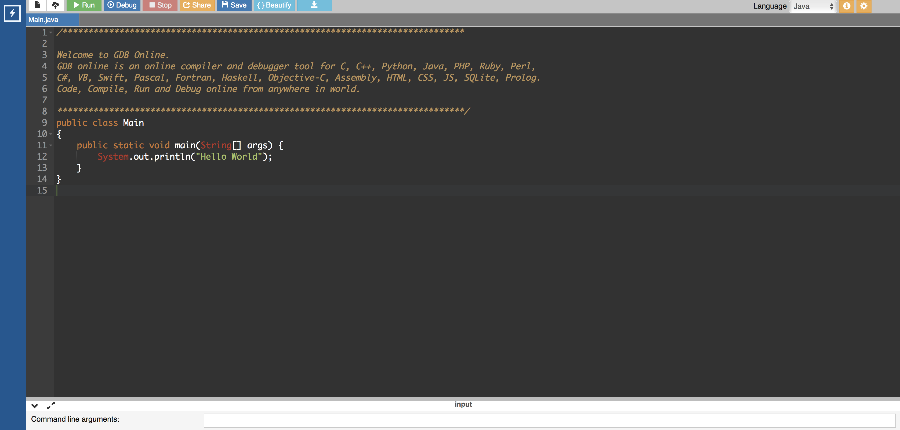
 
Next, let's change some settings. I find it very hard to see the cursor in dark mode here, so I'll click the cog button in the top right and change the editor theme to "Light". Of course, this is optional. I'll then hit the "Done" button at the bottom of the menu to close it.

 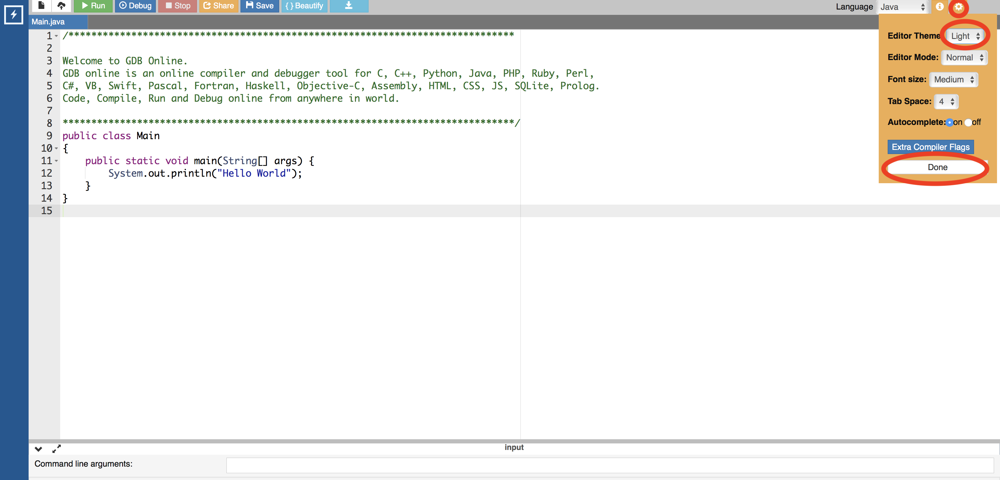
 
Finally, I'll ensure that the language is set to Java. The selection is in the top right, just to the left of the cog button we used to change the editor settings.

 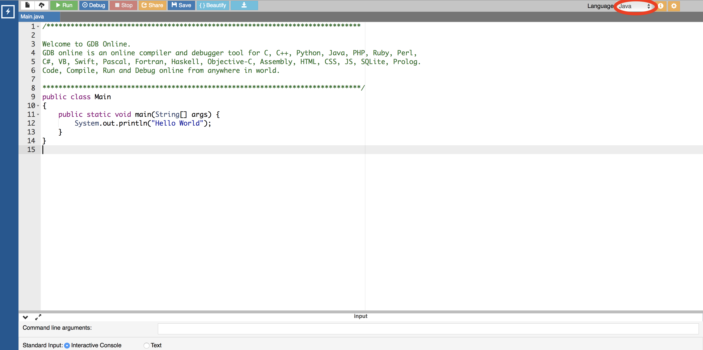

## Adding Your Files

Now that all of the basic settings are taken care of, we're ready to start building our project. First, copy-paste the [`TemperatureConversionClient`](#exClientClass) into **Main.java** (the editor window that is already open), and rename the class `Main`. We can't close this window, and Java classes must be named the same as their containing file, so we'll just use this file to house our program entry point.

 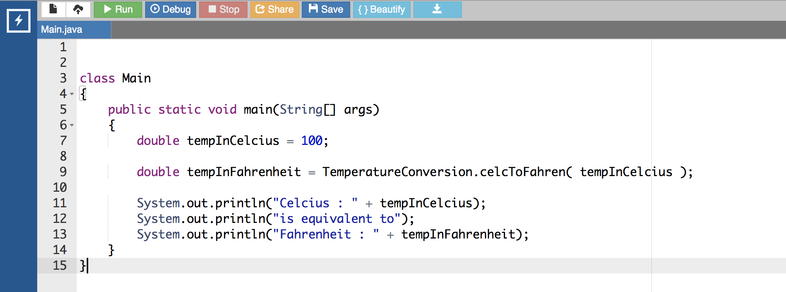
 
Next we can create a new file for our [`TemperatureConversion`](#temperatureConversion) class, and paste its contents into this new file. Click the button in the top left with the file icon (a piece of paper with the corner folded) to create a new file

 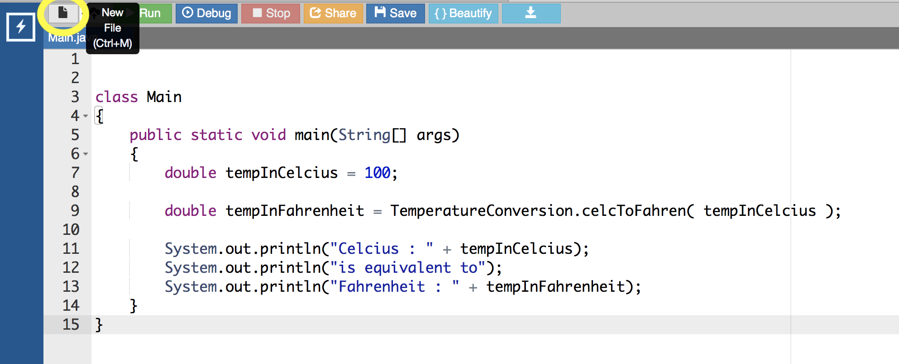

Be sure to name the file **TemperatureConversion.java**, so its name matches that of the class that it defines. After you've named the file, click the "ok" button.

 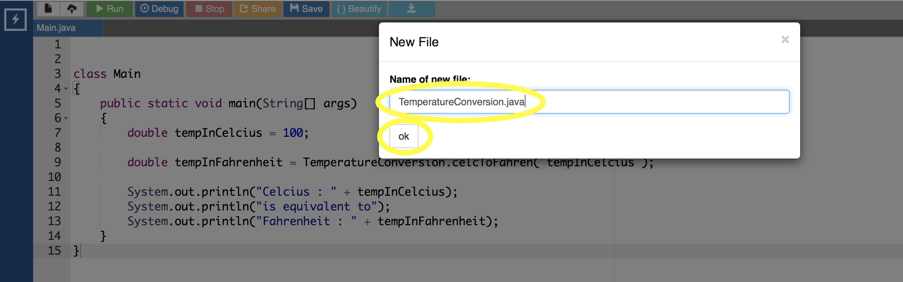

Finally, paste the contents of the [`TemperatureConversion`](#temperatureConversion) class into the new file.

 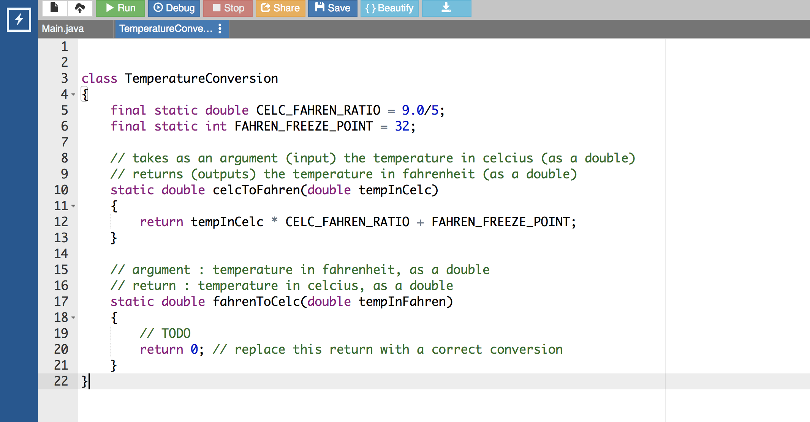
 
## Using the Debugger

Now we're ready to start debugging. Set a **break point** on the line with the statement `double tempInCelcius = 100;` in **Main.java**. You can set a break point on any line by clicking in between the editor pane's line numbers and the text editor itself. A red dot will appear where you clicked, denoting that there is a break point on that line:

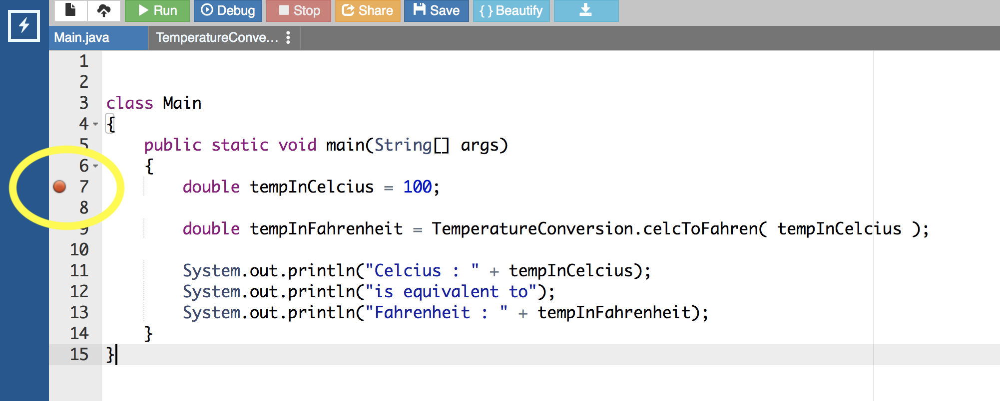

The break point tells the debugger **where to stop** to wait for your instruction; once you run the debugger, the program will run until it hits a break point, and then stop and wait. You can then use the debugger controls to move the program forward step by step, watching variables values change with each step.

Once you've placed the break point, hit the "Debug" button on the top bar. The **Debug Console** will open at the bottom of the screen, and a the **Debug Display** will open on the right side of the screen.

 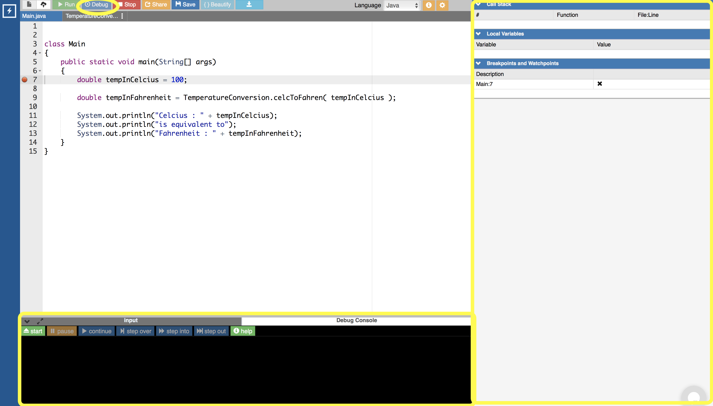

The Debug Console can be used to control the debugger; we'll be using it momentarily to step through the program. The Debug Display will be used to view the values of individual variables as we step through.

Hit the "Start" button in the top left of the Debug Console.

 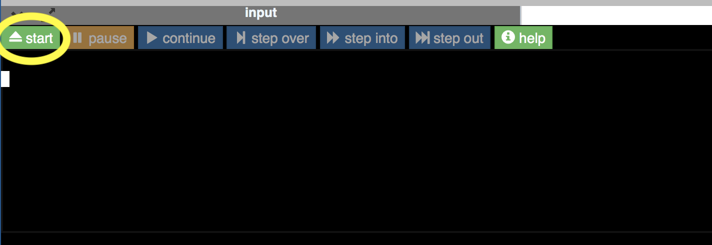

The program should begin running, and stop at the break point. The line that the break point is on will now be outlined in green, denoting where the debugger is stopped in its execution of the program:

 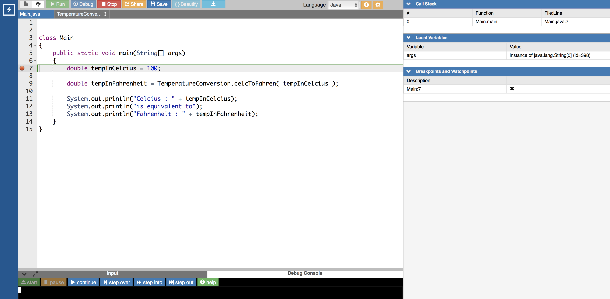

The line outlined in green **has not yet been executed**. Program execution stopped just **before** the statement on this line could run. You can think of the break point as being at the start of the line, before the statement itself.

Now we can start using the debugger to step through our program. Let's go over its controls. The debugger controls are at the top of the Debugger Console:

 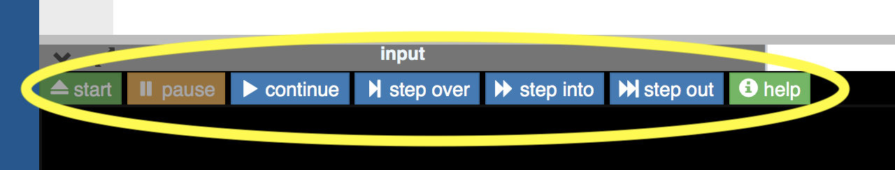

These buttons, from left to right, do the following:

* **start**: Start running the program. It will run until the first break point. The program is already running, so this button is currently functionless (if we want to start the run over, we'll have to hit the "Stop" button next to the "Debug" button above the code editor, then hit "Debug" again).
* **pause**: Pauses the program wherever it is in execution. This button is useful when the program is stuck in a loop somewhere, so it's just running forever, and you'd like to find out where the offending code is.
* **continue**: Run the program until it hits the next break point.
* **step over**: Steps to the next statement in the current file; if the current line uses another file (say, it calls a method defined in another file), you will not enter that function definition to step through it.
* **step into**: Steps to the next line executed, in this file or a different file. If the current execution line calls a method defined in another file, the debugger will step into that method, so you can go through it line by line.
* **step out**: Continue execution until leaving the current method / scope, then stop. This is useful when you are done debugging the current method, or when you accidentally "step into" when you mean to "step over".

In the Debug Display's "local variables" pane, you can see a list of all variables which are accessible from the scope of the current statement:

 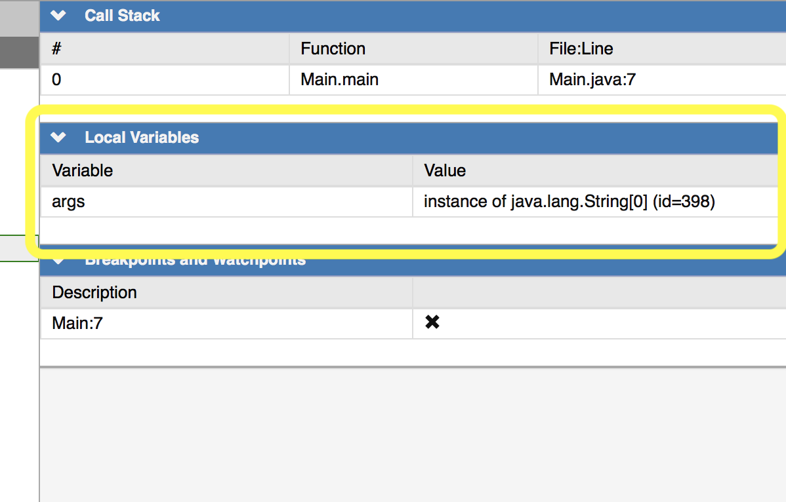

Currently, the statement declaring `tempInCelcius` has not been executed yet, so it is not visible in the variables pane. The only variable that we can see in the pane is the `args` variable (which you can see is the only input for the main method). We'll talk more about the `args` list, and what data is contained in it, when we cover arrays in a future lab.

Try using the **step over** button in the Debug Console to move to the next line. You should end up here:

 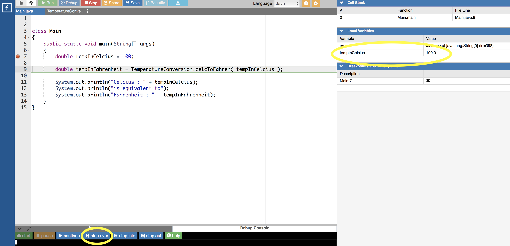

Execution has now stopped just before the statement on line 9 in the picture above. The statement on line 7 has been executed, and the `tempInCelcius` variable is now visible in the variables pane. Line 7 didn't contain any method calls, so if we had chosen to **step into** instead, the result would have been the same.

Notice that line 9 contains a call to the method `TemperatureConversion.celcToFahren`. On this line, we are faced with a choice. If we hit the **step into**, we will step into the `celcToFahren` function, where we can go through it line by line. If we hit **step over** we will fully execute this call to `celcToFahren` without walking through it, and continue executing until reaching the next statement in `Client.java`, which is on line 11 in the image above.

To clarify, in either case the `celcToFahren` method call will happen, but we will not go through it line-by-line if we step over it.

Hit **step into**. You should end up here:

 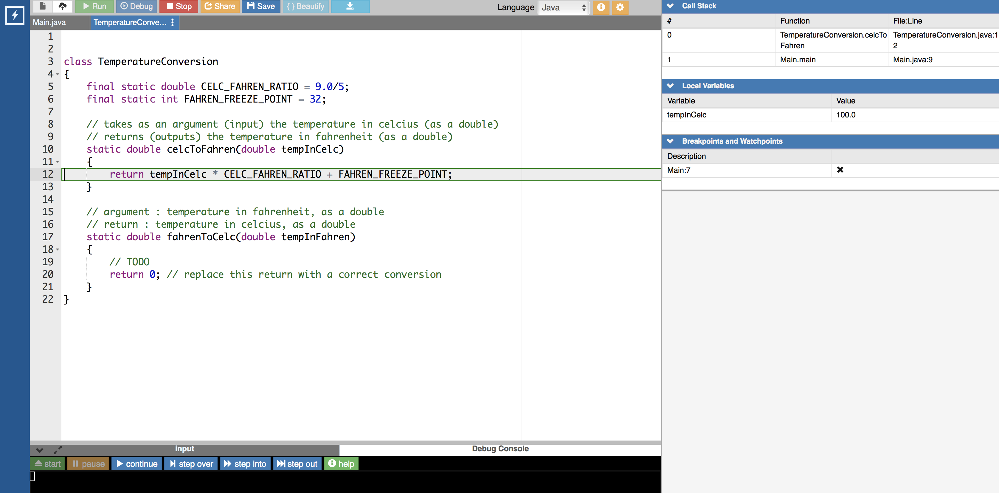

Note that the `tempInCelc` variable now visible in the variables pane is **not** the same one that we could see back in the client. This is a new variable, an **argument** for the `celcToFahren` method, which has been given a copy of the value of the variable that was passed into `celcToFahren` in the client. Next, note that the `args` variable is not displayed, because it isn't accessible in the current scope (inside the `celcToFahren` call). 

Finally, note that an extra value can be seen in the call stack. Before we only had the call stack number 0, in function `Main.main`, in **Main.java:7** (i.e. Main.java on line 7). Now, that element has been moved to call stack number 1 and we have a new element at call stack number 0, in function `TemperatureConversion.celcToFahren`, and execution is at **TemperatureConversion.java:12**. This indicates that the `TemperatureConversion.celcToFahren` call originaged from (or "is part of the execution of") the statement in **Main.java:7**. 

If you hit **step over**, **step into**, or **step out**, the result will be to finish the execution of the `celcToFahren` function (because we are already on its last line) and return to the client, where execution will resume on the line after the method call. Hit one these three buttons, and you should end up here:

 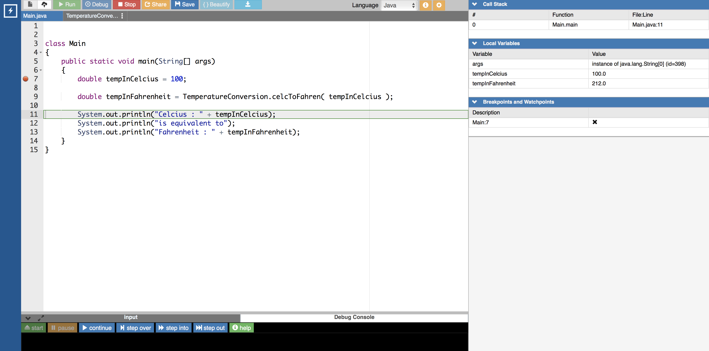

(If you chose **step out** above you would actually end up back on line 9, but **after** the method call was completed, and you'd need to **step into** or **step over** to get to where the image above is).

Now, the variable `tempInFahrenheit` is visible in the variables pane. It has been assigned the value that was output by the `celcToFahren` call. Moreover, we already know that water boils at 100 degrees Celcius and 212 degrees Fahrenheit, so it appears that `celcToFahren` returned the correct result! This doesn't necessarily mean that `celcToFahren` is **always** correct, just that it is correct when converting 100 degrees Celcius to Fahrenheit.

Many programmers are tempted to debug their software by printing status messages to the console stating the values of variables and other pertinent information. This is generally bad practice except in niche cases where the debugger isn't helpful for one reason or another or isn't available. It's bad practice for a few reasons, but the primary one is that it is **tedious** and **slow** relative to using the debugger, which is **easy** and **fast** once you're used to it! If you're using an IDE that doesn't have an integrated Java debugger, and you'd like one that does (but you don't want to use this clunky online one all of the time), feel free to go through [these instructions](https://github.com/arewhyaeenn/OOP_HELLO_WORLD) to set up IntelliJ IDEA. Note that it is local (it is not on the cloud, like Cloud9, so it actually runs on your computer) and that it is not easy on your computer; slower laptops will take several minutes to open it (but once it's open they'll generally run it fine). 

Now that you know how to use a debugger, you're ready to [continue the lab reading](../README.md#Debuggers).
