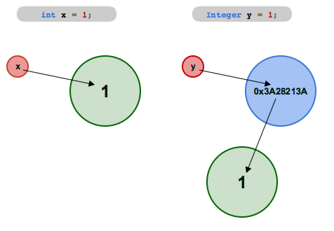
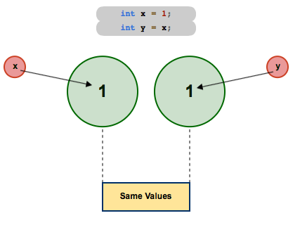
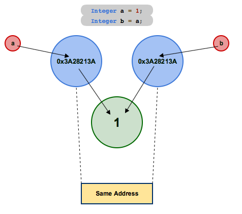
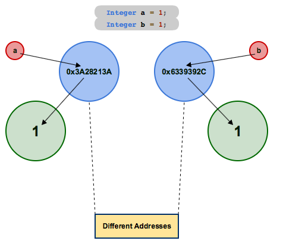

# Object-Oriented Programming - Classes, Objects and Methods

In this lab:

* `import`ing classes.
* Using the `Scanner` class to read input data.
* What is an object?
* Objects vs primitives. Reference vs value.
* What is a class?
* Wrapper classes.
* Methods, writing `static` methods.
* Using Debuggers

## Importing

**packages** contain organized sets of classes, generally with some unifying purpose. They can also contain smaller packages, known as **subpackages**.

If you check the [Java 8 API](https://docs.oracle.com/javase/8/docs/api/), you can see a list of packages available in the Java 8 Standard Edition platform (these are the packages that are available in the Java Development Kit installed on your cloud server or your home computer, depending on your IDE). The acronym **API** is short for **A**pplication **P**rogramming **I**nterface. API for a class tells users how to use the class; in other words, it documents the interface provided by the class through which users can interact with it. We will be looking at the Java API constantly.

Classes can be imported using `import` statements, which are generally at the top of the program outside of the class definition. `import` statments consist of the `import` keyword followed by the name of the package being imported, a `.` (accessor operator) to access a member of that package, and then the class name (the package member being accessed). They look like this: `import <package>.<class>;`.

An example can be found in the previous lab, where we imported the `Scanner` class from the `util` subpackage of the `java` package with the statement:

```java
import java.util.Scanner;
```

Note that the class name `Scanner` is in `PascalCase` while the package and subpackage names `java` and `util` are in `camelCase`. This is a standard across Java packages.

## The `Scanner` Class

We used the `Scanner` class briefly in the previous lab, so you might be familiar with it already. It can be used to parse primitive data from an input source. The input source might be a text file, a `String`, or an `InputStream`. For now, we don't need to know what an `InputStream` is, exactly, we just need to know that there is one called `System.in` which corresponds to input typed in the console, so if we use that `InputStream` as a source, the `Scanner` can be used to get input from the console and parse it. While reading from the source, it divides the inputs into sequences called **tokens**, which are sequences of characters which together have some meaning. For instance, several digits in a row would be grouped as an integer token.

In order to use a `Scanner`, we must **construct** it. The `Scanner` class is essentially a blueprint, which can be used to construct `Scanner` objects associated with specific input sources. The constructed `Scanner` object is said to be an **instance** of the `Scanner` class.

Object construction is done with a method called a **constructor**, which provides instructions detailing how to set up the object. A class's constructor is run with the `new` keyword, followed by the name of the class, and the parenthesis containing any **arguments** (i.e. inputs) for the constructor. The resulting object is usually then referenced by a variable, so the constructor call is usually the right side of an assignment statement. For example, the statement below constructs a new `Scanner` object called `keyboard`:

```java
Scanner keyboard = new Scanner( System.in );
```

In the example above, `System.in` is specified as an argument for the `Scanner` constructor, so the `Scanner` named `keyboard` will receive its input from the console.

Once the `Scanner` has been constructed, it can be used to read and parse inputs using its methods.

Consider the following program:

```java
import java.util.Scanner;

class Survey
{
    public static void main(String[] args)
    {
        Scanner scan = new Scanner ( System.in );
        
        System.out.println("SURVEY TIME");
        
        System.out.println("\nHow many toes do you have?");
        int nToes = scan.nextInt();

        scan.nextLine();
        System.out.println("\nWhy did the chicken cross the road?");
        String whyThough = scan.nextLine();
        
        System.out.println("\ntrue or false : Radishes are the coolest vegetable.");
        boolean radishSoCool = scan.nextBoolean();

        System.out.println("\nSURVEY SUMMARY:");
        
        System.out.println("\nYou have " + nToes + " toes...?");

        System.out.println("\nThe chicken crossed the road because \"" + whyThough + "\"");

        System.out.println("\nRadishes are the coolest vegetable : " + radishSoCool);
    }
}
```

In the program above, a `Scanner` with identifier `scan` is created, and is then used to read user's responses from the console after questions are printed to the console.

<a name="nextChar"></a>
The `Scanner` reads characters from the input source one at a time and parses them into the desired data types (if possible). It has methods to read most of the primitive data types, named accordingly; `nextInt` reads an `int`, `nextDouble` reads a `double` and so on... It does not have a `nextChar` method; this is generally done with `next().charAt(0)`, which reads the next word and then picks out the first character of that word. It also has methods to read different types of `String` data from its input stream; among these are `next`, which reads the next "word" (i.e. all characters up to the next white space), and `nextLine`, which reads all characters up through the next newline character (`'\n'`).

Note that there is an extra call to the `nextLine` method before the second question. This is due to an oddity of how the `Scanner` interacts with its input source:

When a `Scanner` calls a method to read a primitive or the `next` method to read a word, it leaves the newline at the start of the input. This will cause the next `nextLine` call to be blank; it reads until the first newline, and the first character in the stream is a newline. So, that extra call to the `nextLine` method before the second question in the program above is to read this residual newline character out of the input stream, which in turn allows the following `nextLine` call to get the user's input instead of a blank line.

Here is a sample run for the program:

```
SURVEY TIME

How many toes do you have?
7

Why did the chicken cross the road?
Get off my lawn.

true or false : Radishes are the coolest vegetable.
true

SURVEY SUMMARY:

You have 7 toes...?

The chicken crossed the road because "Get off my lawn."

Radishes are the coolest vegetable : true

Process finished with exit code 0
```

<a name="q1"></a>**[EXERCISE 1](#a1)** Write a program which:

1. Prompts the user for two integer values `minimum` and `maximum`.
2. Generates a random `int` called `secretNumber` from `minimum` to `maximum`, inclusive.
	* Check out the [`Random`](https://docs.oracle.com/javase/8/docs/api/java/util/Random.html) class in the `java.util` package.
	* You could find the documentation linked above very easily by googling "Java 8 Random".
	* You'll need to
		* Import the class
		* Construct an instance of it (something like `Random generator = new Random();`)
		* Use an appropriate method from the class to generate a random integer from `minimum` to `maximum`.
	* There are several different ways you could go about this; read through the documentation's method summary and see if you can find something that you can use to accomplish the task at hand.
* Prompts the user for a third `int`, called `guess`.
* Tells the user:
	* What the secret number was.
	* How far off their guess was (use an absolute value, there is a method in the `Math` class for it).

The `Scanner` can be used for inputs from files as well by replacing `System.in` with a `File` object. A `File` can be constructed using a `String` denoting the path from the working directory (i.e. wherever "java" was called) to a file. The following program opens a file called `input.txt` in the working directory and prints every word in the file.

<a name="fileClient"></a>

```java
import java.io.File;
import java.util.Scanner;

class FileClient
{
    public static void main(String[] args) throws java.io.FileNotFoundException
    {
        File inputFile = new File("input.txt");
        Scanner inputFileScanner = new Scanner(inputFile);

        String nextWord = "";

        boolean keepLooping = inputFileScanner.hasNext();
        while ( keepLooping )
        {
            nextWord = inputFileScanner.next();
            System.out.println( nextWord );
            keepLooping = inputFileScanner.hasNext();
        }
    }
}
```

The program above uses a `while` loop, which we'll discuss in the next lab, but you might be able to figure out how it works. `Exception`s will be covered later on, but for now, an `Exception` is and object containing data about an error. Throwing an exception terminates the program (usually with an error message stating what error occured), unless you make additions which "catch" the error and decide what to do about it.

You can provide a path from the project folder to a file in the `File` object constructor to open files in other locations. The program below requires that `input.txt` is in the `src` folder, which must be in the working directory. The `while` loop has also been written more concisely, but it functions the same.

```java
import java.io.File;
import java.util.Scanner;

class FileClient
{
    public static void main(String[] args) throws java.io.FileNotFoundException
    {
        File inputFile = new File("src/input.txt");
        Scanner inputFileScanner = new Scanner(inputFile);

        while ( inputFileScanner.hasNext() )
        {
            System.out.println(inputFileScanner.next());
        }
    }
}
```

<a name="q2"></a>**EXERCISE 2** Modify the `Survey` class to read the responses to survey questions from a file instead of the console. You'll also need to create the file containing the input data.

## What is an Object?

### <a name="valueVsReference"></a> Value vs Reference

The most notable difference between object data and primitive data is that primitive data is **passed by value** whereas object data is **passed by reference**. A reference is an address in memory; it encodes a location. In the case of an object reference, the memory address points to the location at which the object's data is stored.

The `Integer` class constructs `Integer` objects, which are essentially the object equivalent of `int` primitives. The `Integer` class is one of the **wrapper classes**, which we'll talk more about soon. In the picture below, the `x`'s value is simply the `int` value `1`. `y`'s value is **Ox3A28213A**, which is an address (or location) in memory, where the `Integer` object referenced by `y` is located. The key takeaway here is that `x`'s value is the integer value itself, whereas `y`'s value is an address, denoting where the integer value is stored.



In the image below, two `int` variables `x` and `y` are created. `x` is assigned the value `1`, and `y` is assigned `x`. Because primitives are passed by value, the statement `int y = x;` assigns `y`'s value to a copy of `x`'s value.



The same setup leads to a different result with `Integers`. In the image below, two `Integer` variables are declared and assigned. Because `Integers` are objects, not primitives, they are passed by reference. In other words, the address that `a` uses to reference the `Integer` with value `1` is copied into `b`, so `a` and `b` both reference the same address, and are therefore two separate references to the same object data.



Compare the picture above to the one below. 



These "references" are often referred to as "pointers". Java does basically all of reference work under the hood, but it is helpful to understand the difference between reference and value.

### Shared Reference Example

The ability to reference the same object from multiple variables can be useful. It can also be the cause of bugs if not properly accounted for!

The `Point` class from the `java.awt` constructs objects which store integer `(x, y)` coordinates on the Cartesian plane. You can find its documentation [here](https://docs.oracle.com/javase/8/docs/api/java/awt/Point.html).

Consider the example below:

```java
import java.awt.Point;

class ReferenceDemo
{
    public static void main(String[] args)
    {
        // create a Point object with coordinates (0, 0)
        Point origin = new Point(0, 0);

        // create a second point at the same location
        Point otherPoint = origin;

        // move the second point to (4, 3)
        otherPoint.setLocation(4, 3);

        // print out both points
        System.out.println("The origin is at " + origin.toString());
        System.out.println("The other point is at " + otherPoint.toString());
        // oof
    }
}
```

<a name="q3"></a>**[EXERCISE 3](#a3)** Run the program above. Notice that in the output, the `origin` has moved to `(4,3)`. What goes wrong? Are all of the comments accurate?

<a name="q4"></a>**[EXERCISE 4](#a4)** Fix the program above. That is, modify it so that when `otherPoint` is moved, `origin` does not move with it.

### Address Comparisons Example

Before we consider the example below, let's briefly discuss the `==` operator. We've already seen this operator once or twice without any formal explanation. `==` is the equality operator, not to be confused with the assignment operator `=`. The equality operator takes two inputs (the elements to its left and right) and returns `true` if they are equal and `false` otherwise.

Consider the following class:

```java
import java.awt.Point;

class ReferenceEquality
{
    public static void main(String[] args)
    {
        // create a Point at coords (0, 0)
        Point point_1 = new Point(0, 0);

        // create a second Point at coords (0, 0)
        Point point_2 = new Point(0, 0);

        // The points are equal right?
        System.out.println(
                point_1.toString() +
                " equals " +
                point_2.toString() +
                " : " +
                (point_1 == point_2)
        );
    }
}
```

If you compile and run the class above, you will get the following output:

```
java.awt.Point[x=0,y=0] equals java.awt.Point[x=0,y=0] : false

Process finished with exit code 0
```

There are two `Point` objects `point_1` and `point_2` with the same coorinates. `point_1 == point_2` evaluates to `false`. Why? Because objects are passed by reference! `point_1 == point_2` isn't comparing the **values** of the two points, it is comparing the **references** to those points. That is, the `==` operator is checking if the address stored in `point_1` is the same as that stored `point_2`, or identically if the two referenced objects are at the same location in memory. Two objects cannot occupy the same space, so these addresses can only be equal if the objects being compared are actually references to **the same object**. `point_1` and `point_2` do reference objects containing identical data, but they are two distinct points written at two distinct locations in memory, so their addresses are different.

<a name="q5"></a>**[EXERCISE 5](#a5)** Fix the program above to check if the two points have the same coordinates, not if they have the same address. Hint: search the [Point API](https://docs.oracle.com/javase/8/docs/api/java/awt/Point.html) for a suitable method.

### `null`

Objects can be given the value `null`. `null` is the reference equivalent of "no value". Primitives cannot be set to `null`.

<a name="q6"></a>**[EXERCISE 6](#a6)** Run the following program. What exception does it throw? Which line is the exception thrown on? What do you think the exception means? How might you fix it?

```java
import java.util.Scanner;

class NullClient
{
    public static void main(String[] args)
    {
        Scanner scan = null;

        System.out.println("How many fingers do you have?");
        
        int userResponse = scan.nextInt();
        
        System.out.println("Who needs " + userResponse + " of anything, really...");
    }
}
```

### `String`: Primitive or Object?

Java `String`s are a blight inflicted on developers by James Gosling. In some contexts they behave like objects, but in other contexts they behave like primitives. In some contexts treating them like primitives leads to issues and errors.

Let's be clear: `String`s are objects. There are situations in which they behave more like primitives. So, while you can sometimes treat them like primitives and get away with it, you can **always** treat them like objects.

`String`s can be compared to eachother with the `==` operator like primitives, but only if they were created without the `new` keyword; if they were created as references (via object construction, using the `new` keyword) then the `==` operator will compare addresses instead of values like in the `ReferenceEquality` class above. Treating `String`'s like objects and using their `equals` method to check for equal values will always work, regardless of how the `String` was declared.

<a name="q7"></a>**EXERCISE 7** Predict outputs of the snippets below. Run them and test your predictions. Then, shake your clenched fist at the sky and speculate about how James Gosling should be punished.

```java
String s1 = "asdf";
String s2 = "asdf";

System.out.println( s1 == s2 );
```

```java
String s1 = "asdf";
String s2 = "asdf";

System.out.println( s1.equals(s2) );
```

```java
String s1 = new String("asdf");
String s2 = "asdf";

System.out.println( s1 == s2 );
```

```java
String s1 = new String("asdf");
String s2 = "asdf";

System.out.println( s1.equals(s2) );
```

```java
String s1 = new String("asdf");
String s2 = new String("asdf");

System.out.println( s1 == s2 );
```

```java
String s1 = new String("asdf");
String s2 = new String("asdf");

System.out.println( s1.equals(s2) );
```

```java
String s1 = "asd";
s1 += "f";
String s2 = "asdf";

System.out.println( s1 == s2 );
```

<a name="q8"></a>**EXERCISE 8** Write a program in which you try to set a `String` variable's value to `null`, a primitive variable's value to `null`, and any object variable to `null`. Which ones work? Is the `String` behaving like an object or like a primitive?

<a name="q9"></a>**[EXERCISE 9](#a9)** `String`s can be `null`, but there is another `String` literal that is often used to represent the `String` equivalent of `0`. What `String` value do you think this would be?

### Wrapper Classes

Each primitive data type has a corresponding object equivalent, called a **wrapper class**. The shenanigans that we've just explored with `String`s also apply to Java's eight wrapper classes. The `Integer` class that we discussed [above](#valueVsReference) is the `int` primitive's wrapper. The other primitives have similar wrappers; `char` has the `Character` class, `float` the `Float` class, and so on. In addition to instantiating objects, these classes come with utilities which the primitives lack, in the form of useful methods. Find their documentation under the `java.lang` package in the [API](https://docs.oracle.com/javase/8/docs/api/). Wrapper classes do not need to be imported; `java.lang` is the core of the Java language, and is included in every project without importing.

<a name="q10"></a>**[EXERCISE 10](#a10)** Write a program which prompts the user for a single character and then prints values denoting:

* whether the input character is in the english alphabet
* whether the input character is a digit
* the integer value of the character in unicode (in decimal)

You should use the [`Character`](https://docs.oracle.com/javase/8/docs/api/java/lang/Character.html) wrapper class to determine whether the `char` is a digit or in the english alphabet. All of the necessary functions are `static`; we'll cover what this means later on in this lab, but for this exercise you need to know that they're accessed from the `Character` class, and not from an instance of the class. For instance, to check if a `char` called `myChar` is from the english alphabet, you could do `Character.isAlphabetic( myChar )`. The `Scanner` doesn't have a `nextChar` method, but we discussed [here](#nextChar) how to get the first character of an input with the `Scanner`.

## What is a Class?

The truth is, this question is a little too broad for the scope of this discussion. We are not going to all-inclusively define classes. We are going to instead talk about a few common types of classes, and the significance of classes in the Object-Oriented paradigm.

### Object Blueprints

Some classes will serve as blueprints for a new types of objects. A class like this can then be used to create objects (called **instances** of the class) which behave as the class defines. That is, the class defines how its **instance** objects store, mutate and provide access to their stored data, and how they interact with that data and with other entities.

The `Scanner` class provides a blueprint for `Scanner` objects, defining how they are **constructed** (created, "set up") and how they function. We've used this definition to create and use `Scanner` objects in several exercises already.

In future labs, we will be exploring how to create classes that serve as object blueprints. These types of classes are the heart of Object-Oriented Programming.

### Collections of `static` Methods and Constants

Some classes will serve as collections of related `static` methods. We'll talk more about methods in the next section, but they are essentially sequences of statements whose purpose is either to calculate a value or to perform an action. 

`static` members are accessed directly from a class, and do not require a reference to an individual instance of the class. Nonstatic members, on the other hand, are accessed from an individual instance of the class and may reference data stored by that instance.

Consider, for example, the `Math` class. It consists of:

* `static` methods, which are called directly from the class itself, like `Math.pow` used in the last lab.
* `static` constants, also accessed directly through the class, like `Math.PI`.

An object of type `Math` is never created; we never make a `new Math()` like we did with the `Scanner`. To clarify, we **could** create a `new Math()` if we wanted to (we'll discuss why when we get to polymorphism and constructors in a future lab) but there is no reason to do so because the `Math` class doesn't have any nonstatic members.

### Client Classes

Some classes consist of little more than a main method, in which data and methods defined in other files are accessed and used. These classes are generally referred to as **client classes**. Small client classes are a very common part of software development; they are used to test components of (often quite large) systems of software. This is by no means an all inclusive definition of a client.

Most of the classes we've written so far have been client classes.

## Class Variables and Constants

Constants and variables can be declared and initialized in the class body.

Consider the following class:

```java
class TemperatureConversion
{
    final static double CELC_FAHREN_RATIO = 9.0/5;
    final static int FAHREN_FREEZE_POINT = 32;
}
```

The `TemperatureConversion` class above consists of two constant numbers which are useful in conversions between temperatures in Fahrenheit and Celcius. These constants can be accessed for use in other classes.

We can access these values from other classes in the same package. We'll talk about package structure and access in a future lab, but for now, create two classes in the same directory. One should be the `TemperatureConversion` class above, and one the `TemperatureConversionClient` class below:

```java
class TemperatureConversionClient
{
    public static void main(String[] args)
    {
        System.out.println(
                "A change by 1 degree Celcius is a change by " +
                TemperatureConversion.CELC_FAHREN_RATIO +
                " degrees Fahrenheit."
        );

        System.out.println(
                "Water freezes at " +
                TemperatureConversion.FAHREN_FREEZE_POINT + 
                " degrees Fahrenheit."
        );
    }
}
```

When you run the `TemperatureConversionClient` above, it accesses the constants defined in the `TemperatureConversion` class in order to print their values.

## Methods

As mentioned in the previous section, a **method** is essentially a sequence of statements whose purpose is either to calculate a desired value or to perform a desired action or sequence of actions.

### Declaring and Defining `static` Methods

`static` method declarations and definitions appear in the **scope** of the class body. Class definitions looks like this:

```java
class <identifier> { <body> }
```

Though for readability's sake we usually write them like this:

```java
class <identifier>
{
	<body>
}
```

Something is said to be in the **scope** of the class body (or equivalently in the class body) if it is in the curly braces `{}` denoting the boundaries of the class body. Method declarations appear in the class body but not inside any nested blocks.

The simplest `static` method definitions look like this:

```java
static <returnType> <identifier> ( <argument_list> )
{
	<body>
}	
```

where:

* `<returnType>` is the desired data type for the output.
* `<identifier>` is the name that will be used to **call** (i.e. reference, perform) the method.
* The `<argument_list>` is, well, a list of **arguments**, separated by commas. 

Recall that **arguments** are the input data for the function. They are structured much like declarations; the consist of a data type followed by an identifier.

Consider the method definition in the `Calculator` class below:

```java
class Calculator
{
	static int subtract (int operand_1, int operand_2)
	{
		return (operand_1 - operand_2);
	}
}
```

We can tell from the header `static int subtract (int operand_1, int operand_2)`
that:

* The method is `static`, so it will be called directly through the `Calculator` class as `Calculator.subtract`.
* It's `return` (i.e. output) is an `int` value.
* It takes two `int` values as inputs, and refers to them as `operand_1` and `operand_2` during its calculation.

The body of the method above consists of a single statement: `return (operand_1 - operand_2);`

The `return` keywords means "leave the method" or "return to the line from which the method was called". If it is followed by an expression, then the value of that expression is the output or result of the method.

<a name="q11"></a>**[EXERCISE 11](#a11)** Complete the `Calculator` class above by adding `int`methods `add`, `multiply`, `divide` and `modulus`. Then, create a client class to test the methods defined in the `Calculator` class.

### Classes with Methods and Data

Classes can contain a mix of data (in the form of constants and variables) and methods, and these pieces can interact. Below, we expand the `TemperatureConversion` class to include methods for performing conversions:

<a name="temperatureConversion"></a>

```java
class TemperatureConversion
{
    final static double CELC_FAHREN_RATIO = 9.0/5;
    final static int FAHREN_FREEZE_POINT = 32;

    // takes as an argument the temperature in celcius (as a double)
    // returns the temperature in fahrenheit (as a double)
    static double celcToFahren(double tempInCelc)
    {
        return tempInCelc * CELC_FAHREN_RATIO + FAHREN_FREEZE_POINT;
    }

    // argument : temperature in fahrenheit, as a double
    // return : temperature in celcius, as a double
    static double fahrenToCelc(double tempInFahren)
    {
        // TODO
        return 0; // replace this return with a correct conversion
    }
}
```

Classes like this generally do not have main methods; they instead provide a collection of constants, variables and methods to facilitate some tasks in other programs. The `TemperatureConversion` class above can be accessed by other classes in the same project.

Create two new classes in the same directory. The first class should be the [`TemperatureConversion`](#temperatureConversion) class above. The second should be the [client](#exClientClass) class below. This client class defines a main method and uses (**calls**) a method defined in `TemperatureConversion`.

<a name="exClientClass"></a>

```java
class TemperatureConversionClient
{
    public static void main(String[] args)
    {
        double tempInCelcius = 100;

        double tempInFahrenheit = TemperatureConversion.celcToFahren( tempInCelcius );

        System.out.println("Celcius : " + tempInCelcius);
        System.out.println("is equivalent to");
        System.out.println("Fahrenheit : " + tempInFahrenheit);
    }
}
```

If you run the client class above, it should use the `celcToFahren` method from the `TemperatureConversion` class to convert the Celcius temperature of `100` to the corresponding Fahrenheit (`212`) and print both temperatures. Note that this is nowhere near an adequate test; it only tests a single conversion, from 100 Celcius to 212 Fahrenheit. Good tests contain a variety of test cases, with enough cases to confirm that the method(s) being tested work **in general**. Above, we're testing a linear formula, so two test cases should be enough, but there is no general answer for "how many test cases are needed"; this question is problem-specific.

<a name="q12"></a>**EXERCISE 12** Complete the `TemperatureConversion` class above by filling out the `fahrenToCelc` method. Expand the client class above to test this new method.

### `void` Methods

Methods can also simply **do something** and not have an output. Methods like this are called `void` methods because their return type is `void`.

Consider the example below of a class containing a `void` method:

<a name="exStringSlinger"></a>

```java
/*
    The StringSlinger class will consist of data and methods to print random nonsense.

    It is intended to facilitate the printing of bad, uninformative debug messages.
 */

// import a class for generating random primitive data
import java.util.Random;

class StringSlinger
{
    // define an array of 4 Strings, called nonsense.
    final static String[] nonsense = {
            "YEW WOT",
            "Karen please...",
            "oof",
            "No, Patrick, the lid..."
    };

    // construct a Random object to serve as a generator of random indexes
    final static Random generator = new Random();

    // select a random string from the nonsense array above and print it
    static void hurlRandomNonsense()
    {
        // Generate a random index to access the nonesense array
        int index = generator.nextInt( nonsense.length );

        // Print the message located at the specified index in the nonsense array
        System.out.println( nonsense[index] );
    }
}
```

The class above has a few things we haven't discussed yet, so let's go through them.

Let's first look at the constant `nonsense`. `nonsense` is a `String[]` (i.e. an array of `String`s). We'll discuss arrays in more detail later; for now it is sufficient to understand that the array stores the four `String`s seen in its assignment, and that they are associated with (and can be accessed using) the integers `0`, `1`, `2`, and `3`.

There is also an `import` statement, which imports the `Random` class from `java.util`. Instances of the `Random` class can be used to generate random primitive values. We have used the `Random` class in a previous lab exercise, so you might be familiar with it.

In the `hurlRandomNonsense` method, the instantiated `Random` object (called `generator`) is used to generate a random `int`. Specifically, it is used to generate random non-negative `int` less than `nonsense.length`, i.e. less than `4` (the length of the `nonsense` array). That is, `generator` is used to generate a random `int` with value `0`, `1`, `2`, or `3`.

The random `int` is then used to access the corresponding `String` in the `nonsense` array, so it can be printed. The end result is: `hurlRandomNonsense` selects a random element from the `nonsense` array and prints it.

So, there's a lot going on, but the key takeaway here that `hurlRandomNonsense` is of type `void`; it does not `return` anything. In fact, it doesn't even have a `return` keyword, so its execution ends when it reaches the closing curly braces `}` denoting the end of the method body.

<a name="q13"></a>**EXERCISE 13** Create a client class to test the `StringSlinger` class's `hurlRandomNonsense` method.

### Class Methods vs Instance Methods

All of the methods we've defined so far have been `static`; these methods are associated with a class, and are accessed through the class. Instance methods are instead accessed through a class instance (an object). For example, the `nextInt` method of the `Random` class is an instance method, and is accessed through an instantiated object as you can see in [the example above](#exStringSlinger). We will discuss instance methods in much more detail in future labs.

### Methods vs Functions

In most languages, there are both **methods** and **functions**. The two are similar; they are both essentially sequences of statements which may or may not reference input data to perform an action or set of actions or to output a desired value. The difference is that methods are associated with an object or class, whereas functions are standalone processes.

In Java, there is no such thing as a function; processes cannot be defined outside of a class, so every definition is associated with either a class or with instances of a class.

That being said, the formal difference between methods and functions is generally ignored by programmers; many professionals don't even know that there is a difference! Different sources will make contradicting claims about whether a difference exists and what the exact difference is. This is essentially the programmer's equivalent of the Oxford comma debate. In most contexts, the words "function" and "method" will be used interchangeably. One of the two debuggers that we'll discuss below refers to methods as functions, for instance. I've probably erroneously referred to methods as functions a few times already.

## Debuggers

Next we will cover the use of debuggers, integrated into IDEs. Debuggers vary greatly between IDEs, but a few core features are usually approximately the same.

Below are instructions for two debuggers. The first, for IntelliJ IDEA, will likely be useful to anyone using an IDE with an integrated debugger. If you are using an IDE without an integrated debugger (such as Cloud9) or if the IntelliJ IDEA debugger guide doesn't align with your IDE's debugger and it gives you a headache, you may want to use the OnlineGDB guide instead, as this will allow you to avoid installing a new IDE just for its debugger (though you might choose to do so afterward).

[Debugging with IntelliJ IDEA](./IntelliJDebugger/IntelliJDebugger.md)

[Debugging with OnlineGDB](./OnlineGDB/OnlineGDB.md)

<a name="q14"></a>**EXERCISE 14** The `Euclid` class below defines a method called `gcd` which finds the [greatest common divisor](https://en.wikipedia.org/wiki/Greatest_common_divisor) of two non-negative `int`s `x` and `y` (or outputs `0`, if one of the inputs is negative). It contains some functionality that we haven't explored yet. But, we don't necessarily need to understand how it works in order to use it, as long as we know what its output is. Create a client class to test the `gcd` method.

```java
class Euclid
{
    static int gcd(int x, int y)
    {
        // if x is negative or y is negative
        // i.e. if x is less than 0 or y is less than 0
        if (x < 0 || y < 0)
        {
            // return 0, the inputs were invalid
            return 0;
        }

        // if x is less than y
        if (x < y)
        {
            // rerun the gcd function, but with the values switched
            // so the bigger one is first.
            // when a function calls itself, it's called a recursive call
            return gcd(y, x);
        }

        // if y is 0
        if (y == 0)
        {
            // return x, because...
            // the gcd of 0 and x is x as long as x is positive
            return x;
        }

        // return the gcd of y and the remainder of x/y
        return gcd(y, x%y);
    }
}

```

<a name="q15"></a>**EXERCISE 15** Step through the `gcd` with the debugger, and see if you can figure out how it works! Don't stress too much about getting a formal understanding of why it works, just aim for a loose understanding of how; you'll cover this exact algorithm in detail in at least one future class, and likely in several.

## Answers to Selected Exercises

### <a name="a1"></a>**[EXERCISE 1](#q1)**

The program below uses an `if`/`else` statement, which we haven't covered yet. How do you think it works?

```java
import java.util.Scanner;
import java.util.Random;

class GuessingGame
{
    public static void main(String[] args)
    {
        Scanner keyboard = new Scanner( System.in );
        Random generator = new Random();

        System.out.print("Enter the minimum : ");
        int minimum = keyboard.nextInt();

        System.out.print("\nEnter the maximum : ");
        int maximum = keyboard.nextInt();

        int secretNumber = generator.nextInt(maximum - minimum + 1) + minimum;

        System.out.print("\nGuess a number from " + minimum + " to " + maximum + " : ");
        int userGuess = keyboard.nextInt();

        int error = Math.abs(userGuess - secretNumber);

        if (error == 0)
        {
            System.out.println("\nExcellent Guess!");
        }
        else
        {
            System.out.println("\nOoh, sorry, the correct answer was " + secretNumber + ".");
            System.out.println("You were " + error + " away.");
        }
    }
}
```

### <a name="a3"></a>**[EXERCISE 3](#q3)**

The two `Point` variables, `origin` and `otherPoint`, both reference the same `Point` object because `otherPoint` is initialized with `Point otherPoint = origin;` and then never reassigned. The comment above this line isn't accurate; no second `Point` is created, a second reference is made to a pre-existing `Point`.

### <a name="a4"></a>**[EXERCISE 4](#q4)**

```java
import java.awt.Point;

class ReferenceDemo
{
    public static void main(String[] args)
    {
        // create a Point object with coordinates (0, 0)
        Point origin = new Point(0, 0);

        // create a second point at the same location
        Point otherPoint = new Point(0,0);

        // move the second point to (4, 3)
        otherPoint.setLocation(4, 3);

        // print out both points
        System.out.println("The origin is at " + origin.toString());
        System.out.println("The other point is at " + otherPoint.toString());
        // oof
    }
}
```

### <a name="a5"></a>**[EXERCISE 5](#q5)**

Replace `point_1 == point_2` with `point_1.equals(point_2)` to use the `Point` class's definition of equality (equal coordinates) instead of the generic object definition of equality (equal addresses).

### <a name="a6"></a>**[EXERCISE 6](#q6)**

The program throws a `NullPointerException` on the line with the `scan.nextInt()` call. Here `scan` is `null`, so there is no reference to an object from which the `nextInt` method can be referenced. We could fix this by constructing a `Scanner` and assigning it to `scan` before making the `nextInt` call.

### <a name="a9"></a>**[EXERCISE 9](#q9)**

The `String` equivalent of `0` is the **empty string**, whose literal is `""` (i.e. `String myEmptyString = "";`). It is a `String` containing no characters.

### <a name="a10"></a>**[EXERCISE 10](#q10)**

```java
import java.util.Scanner;

public class CharacterClient
{
    public static void main(String[] args)
    {
        Scanner keyboard = new Scanner(System.in);

        System.out.println("Enter a character:");
        char userChar = keyboard.next().charAt(0);

        System.out.println( userChar + " is in the English alphabet: " + Character.isAlphabetic(userChar) );
        System.out.println( userChar + " is a digit: " + Character.isDigit(userChar) );
        System.out.println( userChar + " is the number " + (int) userChar + " in unicode." );

        // The unicode integer value can be done like below as well, but why bother?
        // The int type can store char data, as discussed in a previous lab, specifically because
        // chars are actually just ints with a standard (unicode) by which to decide which
        // int represents which character
        char[] userCharButInAnArrayBecauseWhyNot = {userChar};
        System.out.println( userChar + " is the number " + Character.codePointAt(
                userCharButInAnArrayBecauseWhyNot, 0) + " in unicode."
        );
    }
}
```

### <a name="a11"></a>**[EXERCISE 11](#q11)**

```java
class Calculator
{
    static int add (int operand_1, int operand_2)
    {
        return operand_1 + operand_2;
    }

    static int subtract (int operand_1, int operand_2)
    {
        return operand_1 - operand_2;
    }

    static int multiply (int operand_1, int operand_2)
    {
        return operand_1 * operand_2;
    }

    static int divide (int operand_1, int operand_2)
    {
        return operand_1 / operand_2;
    }
}
```

```java
import java.util.Scanner;

class CalculatorClient
{
    public static void main(String[] args)
    {
        Scanner console = new Scanner(System.in);

        System.out.println("Enter two integer operands:");

        int op1 = console.nextInt();
        int op2 = console.nextInt();

        System.out.println("Calculator.add(" + op1+ ", " + op2 + ") returns : " + Calculator.add(op1, op2));
        System.out.println("Calculator.subtract(" + op1+ ", " + op2 + ") returns : " + Calculator.subtract(op1, op2));
        System.out.println("Calculator.multiply(" + op1+ ", " + op2 + ") returns : " + Calculator.multiply(op1, op2));
        System.out.println("Calculator.divide(" + op1+ ", " + op2 + ") returns : " + Calculator.divide(op1, op2));
    }
}
```

# Lab Assignment

Tasks 1-7 must all be done.

Tasks 8-10 ask you to research Java functionality that we haven't covered yet; do at least one of these tasks.

## Task 1

Write a program which prompts the user for `int` values and uses them to create three instances of the `Point` class from `java.awt`. Use the `Point` class's `distance` method to calculate the distances between the three points**\*\***. These three distances are the side lengths for a triangle. Calculate and print the perimeter and area of the triangle (check out [Heron's formula](https://en.wikipedia.org/wiki/Heron%27s_formula) for the area).

**\*\*** Not all of the `Point` class's methods are listed on its [API](https://docs.oracle.com/javase/8/docs/api/java/awt/Point.html) directly. Some methods are **inherited** from other classes. These methods are listed in the API at the bottom of the *Method Summary* section, in subsections called **Methods inherited from \<some\_other\_class\>**. We're not going to go in depth on what inheritance is right now; we'll talk about it later in the semester. For now, know that any `Point` can use the methods it inherits from other classes, because it **is** an instance of those classes. The `Point` class inherits from the `java.awt.geom.Point2D` class, which means a `Point` is a `Point2D`, but with some extra stuff. So, a `Point` can do anything a `Point2D` can do, including using and being an argument for the `Point2D.distance` method. Click one of the `distance` methods in the **Methods inherited from class java.awt.geom.Point2D** section.

## Task 2

Run the [`FileClient`](#fileClient) with the debugger (with a break point on the line with `while`). You'll need to create a file called input.txt in the src folder (which the program will open) and add some (any) contents to it.

Expand the `inputFileScanner` variable in the debugger window to check out its stored data. How much of it can you make sense of?

Watch the values of `keepLooping`, `nextWord` and `inputFileScanner`'s `buf` field in the debugger as you step through the loop multiple times.

In your documentation, address the following:

* What do you think the `Scanner`'s `hasNext` method does?

* Theorize about what the `while` statement does.

Try to create a different `while` statement which does something else.

Your submission should be your java file with a new `while` statement, any input files that it uses (if applicable), and screenshots of its output. Your theorizing about the `while` statement should be commented in your java file.

## Task 3

Create a class like the [`TemperatureConversion`](#temperatureConversion) class, but for converting angles between degrees and radians. Create a client class to test it.

You will find the `Math.PI` constant useful here (don't hard-code a worse approximation, like `3.14`).

## Task 4

Expand your program from Task 1 to also print the angles in the triangle, in both degrees and radians. You might find the [law of cosines](https://en.wikipedia.org/wiki/Law_of_cosines) useful.

The `Math` class contains trigonometric functions including `sin`, `cos`, `asin` and `acos`.

## Task 5

Write a program which prompts the user for a date, and tells them what day of the week that date falls on by using the trick described [here](https://cs.uwaterloo.ca/~alopez-o/math-faq/node73.html).

Then, write a second program which instead uses an imported class to perform the same task (you'll need to do some google searching to determine which class to use).

In comments, reflect on your implementations. Which is easier to implement, once you're familiar with all of the classes being used?

## Task 6

Write a program which asks the user for their birthday, and then prints the number of years, days, hours, minutes, and seconds until midnight at the start of their birthday.

You do not need to ask the user for the current date and time, nor do you need to do any of the calculations by hand; find a class for storing and manipulating date-time data in Java and use it.

## Task 7

Write a program which prompts the user for 2 integers, and calculate their quotient (using floating point division). Use the [`DecimalFormat`](https://docs.oracle.com/javase/8/docs/api/java/text/DecimalFormat.html) class to print the quotient:

* As a decimal number, with only two digits shown after the decimal point
* As a percentage, again with only 2 digits shown after the decimal point.

## Task 8

Write a class containing a method which takes as an argument an integer `n` and finds the n'th [fibonacci number](https://en.wikipedia.org/wiki/Fibonacci_number). This will require either a loop or [recursion](https://en.wikipedia.org/wiki/Recursion).

Create a client class to test this method.

## Task 9

Create a class containing a method called `reverseString` which takes as input a `String` and returns that same `String`, backwards.

This can be done with a loop and the `String` class's `charAt` method, or it can be done using an appropriate method from the [`StringBuilder`](https://docs.oracle.com/javase/8/docs/api/java/lang/StringBuilder.html) class.

## Task 10

Create a class with a method called `makeChange`. The method should take as an argument an integer, specifying a number of cents, and should return an array containing four integers denoting the number of quarters, dimes, nickels and pennies necessary to make the requested amount of change.

Write a client class to test your `makeChange` method.

We haven't talked about arrays yet, so you'll need to do some research on how to create them, give them values, and access and modify those values.
